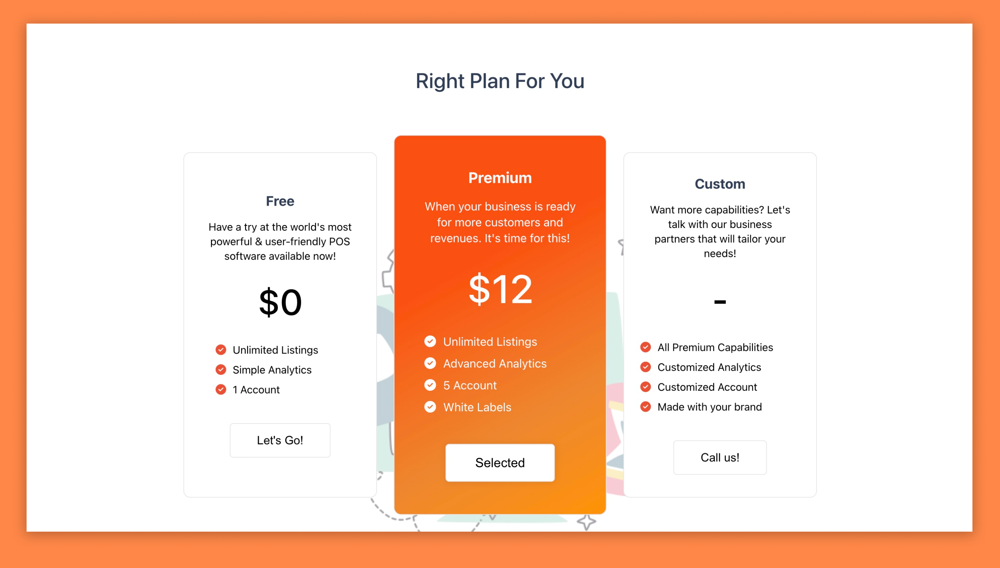

# Pricing Table

## Description

The Pricing Table project provides users with various pricing options and allows them to toggle between different pricing tables.

## Installation

1. Clone the repository: git clone https://github.com/shiiivani/pricing-table.git

2. Navigate to the project directory: cd pricing-table

3. Install dependencies: npm install

## Usage

1. Start the development server: npm start

2. Open your browser and navigate to http://localhost:3000 to view the pricing tables.

- Users can toggle between different pricing options to view details and make selections.

To view the live project, visit this link: [Live Demo](http://shiiivani.github.io/pricing-table)
